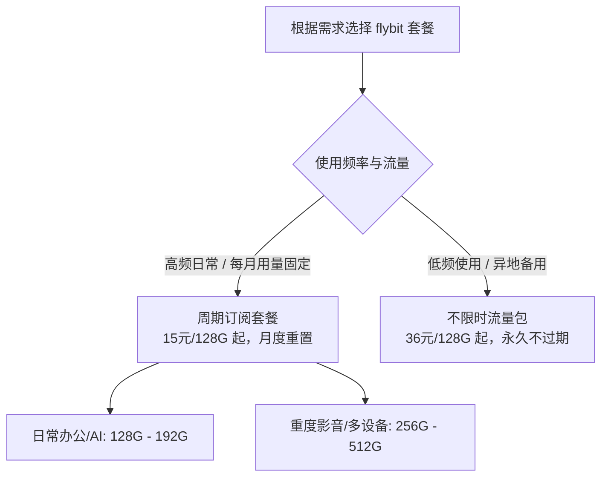

# 🌐 flybit 机场解析与使用指南

> **💡 摘要**：flybit 是一款主打高性价比的 IEPL 专线机场，15 元 128G 起步。核心卖点在于低门槛月付、不限连接设备数、全面解锁主流流媒体与 ChatGPT/Bing AI，并提供一次性不限时流量包。非常适合预算有限、希望验证晚高峰稳定表现的用户。

---

## 📌 快速直达

> [!TIP]
> **官方入口**：👉 [点击直达 flybit 官网注册页面](https://yinxingren1.invisibleaff.com/#/register?code=Gcp1CRso)

---

## 📋 目录

- [一、 平台概览与注册入口](#一-平台概览与注册入口)
- [二、 可用套餐对比](#二-可用套餐对比)
- [三、 核心优势与场景选路](#三-核心优势与场景选路)
- [四、 快速上手步骤](#四-快速上手步骤)
- [五、 常见问题 (FAQ)](#五-常见问题-faq)
- [六、 全平台客户端推荐](#六-全平台客户端推荐)

---

## 一、 平台概览与注册入口

| 项目 | 详细说明 |
| :--- | :--- |
| **服务名称** | flybit 机场 |
| **线路类型** | IEPL 全专线（低延迟、高稳定性） |
| **设备限制** | 不限制客户端与并发设备连接数量 |
| **解锁能力** | 解锁 Netflix、Disney+、YouTube Premium、ChatGPT、Bing AI 等 |
| **服务特点** | 高性价比、全天候节点可用、提供一次性不限时流量包 |
| **官网入口** | 👉 [点击直达 flybit 官网注册页面](https://yinxingren1.invisibleaff.com/#/register?code=Gcp1CRso) |

> [!NOTE]
> **优惠提示**：具体套餐内容及优惠政策请以官网最新显示为准，购买前记得领取首页优惠券。

---

## 二、 可用套餐对比

### 1. 周期订阅套餐（月付）

| 套餐名称 | 方案价格 | 月流量 | 计费周期 | 特点与适用场景 |
| :--- | :---: | :---: | :---: | :--- |
| **每月-128G** | ¥15.00 / 月 | 128 GB/月 | 月付 | 不限设备；解锁流媒体/AI，适合轻度日常使用 |
| **每月-192G** | ¥22.00 / 月 | 192 GB/月 | 月付 | 不限设备；解锁流媒体/AI，适合中度网页与社交 |
| **每月-256G** | ¥28.00 / 月 | 256 GB/月 | 月付 | 不限设备；解锁流媒体/AI，适合高频办公与视频 |
| **每月-512G** | ¥52.00 / 月 | 512 GB/月 | 月付 | 不限设备；解锁流媒体/AI，适合大流量重度使用 |

### 2. 一次性不限时流量包

| 套餐名称 | 一次性价格 | 总流量 | 有效期限 | 特点与建议 |
| :--- | :---: | :---: | :---: | :--- |
| **不限时-128G** | ¥36.00 / 一次性 | 128 GB | 永久有效 | 不按月清零，不限设备，适合低频备用 |
| **不限时-256G** | ¥68.00 / 一次性 | 256 GB | 永久有效 | 无期限，适合多设备轻度长期备用 |
| **不限时-512G** | ¥128.00 / 一次性 | 512 GB | 永久有效 | 长期有效流量，适合大流量低频用户 |
| **不限时-1024G** | ¥238.00 / 一次性 | 1024 GB | 永久有效 | 1TB 永久流量包，极高性价比长期备用 |

---

## 三、 核心优势与场景选路

### 1. 核心优势
* **全专线节点**：采用 IEPL 专线，抗封锁能力强，即使在晚高峰期也能保证稳定的连接速度与低延迟。
* **流媒体与 AI 全解锁**：原生支持 Netflix、Disney+、YouTube Premium 以及 ChatGPT、Bing AI 等人工智能服务。
* **灵活无门槛**：提供低至 15 元的月付方案，同时支持不限时流量包，且完全不限制设备数量。

### 2. 套餐选择策略

## 四、 快速上手步骤

1. **账户注册与订阅**：通过 [flybit 官网链接](https://yinxingren1.invisibleaff.com/#/register?code=Gcp1CRso) 完成注册，领取首页优惠券并购买合适套餐。
2. **设备客户端配置**：根据所用操作系统下载对应的代理客户端，一键导入订阅链接。
3. **连通测试**：开启代理，测试晚高峰速度及流媒体/ChatGPT 解锁状态。

---

## 五、 常见问题 (FAQ)

<b>Q1：flybit 机场晚高峰表现如何？</b>

 
flybit 采用 IEPL 专线传输，相较于普通公网中转或直连线路，晚高峰期间的延迟和抖动更小，能维持稳定的连接速率。

<b>Q2：月付套餐和不限时流量包有什么区别？</b>

 
月付套餐流量按月重置，适合每天都需要使用的用户；不限时流量包无时间限制、用完为止，适合用量较少或作为备用线路的用户。

<b>Q3：是否有设备连接数量限制？</b>

 
官方全套餐均不限制客户端与设备连接数量，个人多设备或家庭共享均可使用。

---

## 六、 全平台客户端推荐

| 操作系统 | 平台图标 | 推荐客户端列表 |
| :--- | :---: | :--- |
| **Windows** |  | FlClash、Clash Verge Rev |
| **macOS** |  | FlClash、Clash Verge Rev |
| **iOS / iPadOS** |  | Shadowrocket、Quantumult X、Surge、Loon |
| **Android** |  | FlClash、V2rayNG、Clash Meta for Android |
| **路由器系统** |  | OpenWrt、LEDE |
